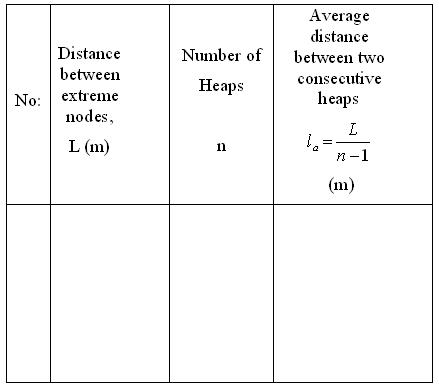

## Procedure

### Apparatus:
 

A long glass tube, piston, metal rod, powdered cork, ruler, clamps and leather piece.

<h2>Procedure for Performing Real Lab:</h2>
<ol>
  <li>Take the glass tube and put some powdered cork dust in it.</li>
  <li>By fast rotatory movement, distribute the powder uniformly inside the tube.</li>
  <li>Fix the tube tightly with the holder.</li>
  <li>Tightly clamp the metal rod at the centre.</li>
  <li>Introduce the piston to the other end of the glass tube.</li>
  <li>Rub the rod at <strong>B</strong>, lengthwise with a piece of rosined leather and set it into longitudinal vibrations at its fundamental frequency.</li>
  <li>Move the piston in and out of the tube until resonance is obtained.</li>
  <li>The cork dust inside the tube becomes deposited as heaps.</li>
  <li>Select the position of the extreme nodes carefully and measure the distance between them. Find the number of heaps and calculate the average distance between two consecutive peaks.</li>
  <li>Note the length of the rod and repeat the experiment.</li>
  <li>The velocity of sound through air is taken as 343 m/s.</li>
  <li>Using equation (3), calculate the velocity of sound through the rod.</li>
  <li>Using equation (5), calculate the Young's modulus of the rod.</li>
</ol>

<h4>Note:</h4>
<ul>
  <li>The glass tube must be perfectly dry as moisture affects sound velocity.</li>
  <li>The metallic rod should be clamped exactly at the middle.</li>
  <li>The powder must be evenly spread.</li>
  <li>The disc should not touch the glass tube, as it may cause the tube to break.</li>
</ul>

<h2>Procedure for Simulator:</h2>
<ol>
  <li>From the combo box <strong>Select Material</strong>, select the material of the rod.</li>
  <li>Click the <strong>Start Rubbing</strong> button to set longitudinal vibrations in the rod.</li>
  <li>Use the <strong>Rod Length</strong> slider to select the desired length of the experimental rod.</li>
  <li>Use the <strong>Piston Position</strong> slider to move the piston in and out of the glass tube to obtain resonance. At resonance, the dust will appear as heaps.</li>
  <li>Use the <strong>Scale Position</strong> slider to move the ruler and measure the length between the desired number of heaps. From that, calculate the length of one heap.</li>
  <li>The <strong>Show Result</strong> option displays the velocity of sound waves and the Young's modulus of the rod material.</li>
  <li>Click the <strong>Reset</strong> button to reset the conditions.</li>
  <li>The experiment can be repeated for different materials and rod lengths.</li>
</ol>

<h3>Observations:</h3>

<ul>
  <li>Length of the rod, <strong>lr</strong> = …………… m</li>
  <li>Frequency of sound used, <strong>f</strong> = ………. Hz</li>
  <li>Velocity of sound in air, <strong>Va</strong> = 343 m/s</li>
</ul>

<strong>Mean</strong> <em>la</em> = ……………. m

<h3>Result:</h3>
<ul>
  <li>The velocity of sound wave through the rod = ………………… m/s</li>
  <li>Young’s modulus of the material of the rod = ………………. N/m²</li>
</ul>

     

# Procedure to View the Experiment Animation.

    <a href="simulation/flash/flashplayer.exe" class="download-link" download>
      <svg xmlns="http://www.w3.org/2000/svg" width="18" height="18" fill="white" viewBox="0 0 16 16">
        <path d="M.5 9.9V14a1 1 0 0 0 1 1h13a1 1 0 0 0 1-1V9.9a.5.5 0 0 0-1 0V14H1V9.9a.5.5 0 0 0-1 0z"/>
        <path d="M7.646 11.854a.5.5 0 0 0 .708 0l3-3a.5.5 0 0 0-.708-.708L8.5 10.293V1.5a.5.5 0 0 0-1 0v8.793L5.354 8.146a.5.5 0 1 0-.708.708l3 3z"/>
      </svg>
      Click Here to Download Flash Player
    </a>
  

 

  
<h4>Flash Content link:</h4>

  
  
📋

  
Copied!

<h2>Instructions to run the Flash animation on your system:</h2>

<strong>▶ Windows system</strong> 
<strong>Step 1:</strong> Open Flash Player 
 
<strong>Step 2:</strong> Copy the Flash content link by click the 📋 icon provided above. 

<strong>Step 3:</strong> Click <em>File → Open</em> from the Flash Player menu. 
<strong>Step 4:</strong> Paste the Flash content link in the Open window of the Flash Player and click the OK button. 
  

<strong>▶ Linux system</strong> 
<strong>Step 1:</strong> Install <code>Wine</code> on your Linux system. 
For Ubuntu: <code>sudo apt update</code> 
<code>sudo apt install wine</code> 
For Fedora: <code>sudo dnf install wine</code> 
<strong>Step 2:</strong> Open terminal and navigate to the folder where the Flash Player is downloaded. 
<strong>Step 3:</strong> Open the Flash Player using <code>wine flashplayer.exe</code> 
 
<strong>Step 4:</strong> Copy the Flash content link by click the 📋 icon provided above. 
<strong>Step 5:</strong> Click <em>File → Open</em> from the Flash Player menu. 
<strong>Step 6:</strong> Paste the Flash content link in the Open window of the Flash Player and click OK. 

