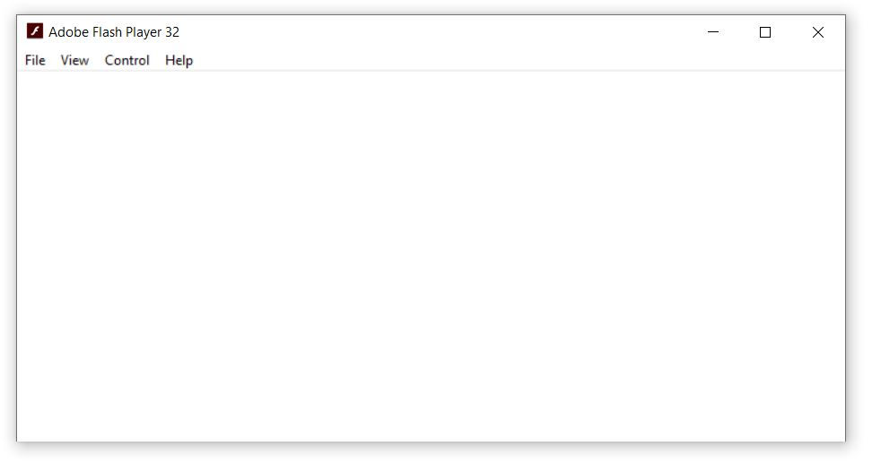
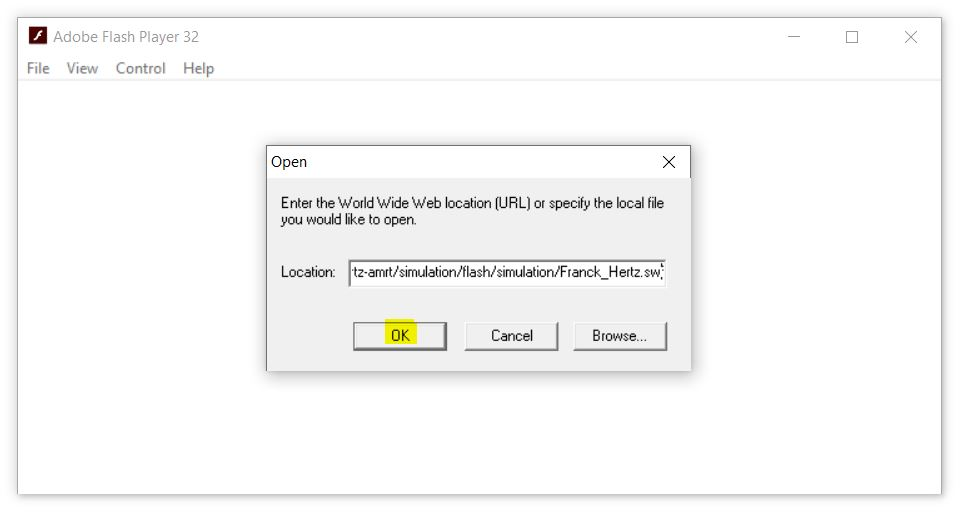

### Procedure

     

# Procedure to View the Experiment Animation.

    <a href="simulation/flash/flashplayer.exe" class="download-link" download>
      <svg xmlns="http://www.w3.org/2000/svg" width="18" height="18" fill="white" viewBox="0 0 16 16">
        <path d="M.5 9.9V14a1 1 0 0 0 1 1h13a1 1 0 0 0 1-1V9.9a.5.5 0 0 0-1 0V14H1V9.9a.5.5 0 0 0-1 0z"/>
        <path d="M7.646 11.854a.5.5 0 0 0 .708 0l3-3a.5.5 0 0 0-.708-.708L8.5 10.293V1.5a.5.5 0 0 0-1 0v8.793L5.354 8.146a.5.5 0 1 0-.708.708l3 3z"/>
      </svg>
      Click Here to Download Flash Player
    </a>
  

 

  
<h4>Flash Content link:</h4>

  
  
📋

  
Copied!

<h2>Instructions to run the Flash simulator on your system:</h2>

<strong>▶ Windows system</strong> 
<strong>Step 1:</strong> Open Flash Player 
 
<strong>Step 2:</strong> Copy the Flash content link by click the 📋 icon provided above. 

<strong>Step 3:</strong> Click <em>File → Open</em> from the Flash Player menu. 
<strong>Step 4:</strong> Paste the Flash content link in the Open window of the Flash Player and click the OK button. 
  

<strong>▶ Linux system</strong> 
<strong>Step 1:</strong> Install <code>Wine</code> on your Linux system. 
For Ubuntu: <code>sudo apt update</code> 
<code>sudo apt install wine</code> 
For Fedora: <code>sudo dnf install wine</code> 
<strong>Step 2:</strong> Open terminal and navigate to the folder where the Flash Player is downloaded. 
<strong>Step 3:</strong> Open the Flash Player using <code>wine flashplayer.exe</code> 
 
<strong>Step 4:</strong> Copy the Flash content link by click the 📋 icon provided above. 
<strong>Step 5:</strong> Click <em>File → Open</em> from the Flash Player menu. 
<strong>Step 6:</strong> Paste the Flash content link in the Open window of the Flash Player and click OK. 

