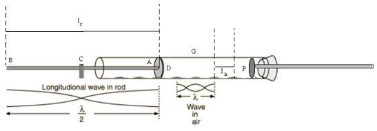

## Theory 

<strong>Kundt’s tube</strong> is an acoustical apparatus, invented by German physicist August Kundt (1866). Knowing the speed of sound in air, the speed of sound <strong>V</strong> in a solid rod can be calculated based on the measurement of sound wavelength, <strong>λ</strong>.

If the frequency of the sound wave, <strong>f</strong>, is known, we can calculate the speed of sound as:

$$V=f\lambda$$

<h3>Kundt’s Tube Apparatus:</h3>

The apparatus consists of a long transparent horizontal pipe <strong>G</strong>, which contains a fine powder such as cork dust or talc. At the ends of the tube, there are metal fittings.

At one end of the tube, a metallic rod <strong>AB</strong>, of uniform radius and about one or two meters in length, is introduced. This rod is clamped at the middle and carries a circular disc <strong>D</strong>, rigidly fixed at one end. The radius of the disc is slightly less than the radius of the glass tube.

The rod is inserted a few centimeters inside the tube, without touching it. The other end of the glass tube is closed by a metallic piston, <strong>P</strong>. The position of the piston can be adjusted by moving it in or out.

The whole apparatus is tightly clamped on a table, so that there will be no jerks on the tube during the experiment.

<em>The schematic diagram of a Kundt’s tube is shown below.</em>

The tube is dried and fixed in position after spreading a thin layer of cork dust in it. When the rod is set into longitudinal vibrations at its fundamental frequency by rubbing it with a piece of rosined leather at <strong>B</strong>, the ends of the rod act as <strong>anti-nodes</strong> and the middle point acts as a <strong>node</strong>.

The length of the metal rod is equal to half the wavelength of the sound wave in the material of the rod. The disc begins to vibrate backward and forward. The air inside the glass tube is set into forced vibrations with the frequency of the wave emitted, and stationary waves are produced by reflection at the piston.

On altering the position of the piston, a point is reached where an overtone of the air column coincides with the fundamental of the rod, and thus produces <strong>resonance</strong> within the tube. At this stage, the cork dust in the tube is violently agitated and collects as heaps at the <strong>nodes</strong>.

The average distance between the successive heaps will be equal to <strong>half the wavelength</strong> of sound in air.

If <strong>la</strong> is the mean distance between the consecutive nodes of cork dust in air and <strong>lr</strong> is the length of the metal rod, then:

Wavelength of sound wave in air:

$$\lambda_a=2l_a$$

Wavelength of sound wave in the rod,

$$\lambda_r=2l_r$$

If f is the frequency of vibration produced, the velocity of the sound wave through the rod and air is given by,

$$V_r=2fl_r.................(1)$$

$$V_a=2fl_a .................(2)$$

Hence,                  

$$V_r=V_a\frac{l_r}{l_a}.................(3)$$

Knowing the speed of sound in air, we can calculate the speed of sound in the rod.                         
 

The velocity of sound in a solid material is given by,

$$V_r=\sqrt{\frac{Y}{\rho}}............(4)$$

Where <strong>Y</strong> is the Young’s modulus of the material of the rod and <strong>ρ</strong> is the density.

Then,

$$Y=V_r^2\rho ................(5)$$

